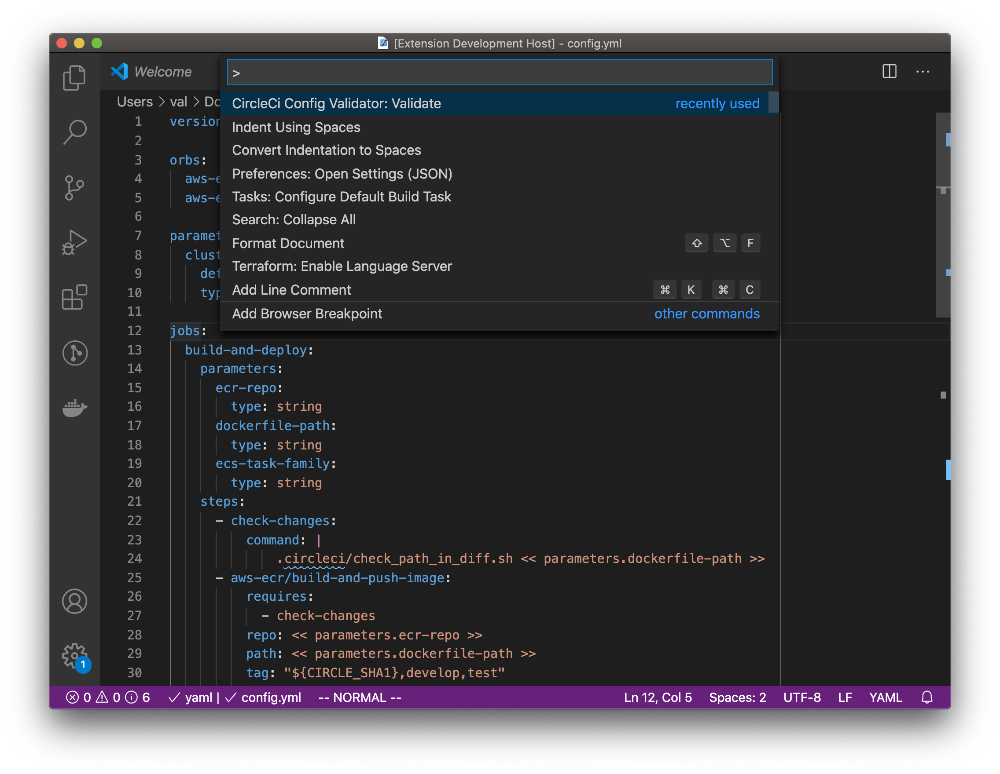
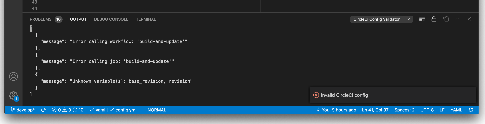

# circleci-config-validator

Here lies the VSCode extension "circleci-config-validator". __What does it do?__ It validates your CircleCI config in VSCode.

This is free and open source software! If you find this extension helpful please:
- [rate this extension](https://marketplace.visualstudio.com/items?itemName=valmack.circleci-config-validator&ssr=false#review-details) or [fund my licorice addiction](https://www.buymeacoffee.com/valmack)

## Features

After opening your CircleCI `config.yml` file, select the `CircleCI Config Validator: Validate` command from the command palette. You should see a prompt in the bottom right that says if your config is valid or invalid.

To see the list of errors open the VSCode `PROBLEMS` console.

## Installation

Search for `CircleCI Config Validator` in the VSCode extensions marketplace and you should find it.

## Requirements

This is a super minimal extension but it is making http requests to the CircleCI API servers so keep that in mind if you notice delays.

## Release Notes

### 0.0.1

Initial release!

## Contributing

1. Create an issue discussing how and why your contribution will improve this extension.
2. Fork, code, test, and submit a PR!

-----------------------------------------------------------------------------------------------------------

**Enjoy!**

> Note: This extension is not built or endorsed by Circle Internet Services, Inc., who makes CircleCI. This software is under the same license as their APIs. CircleCI is great. Please don't sue me :)
